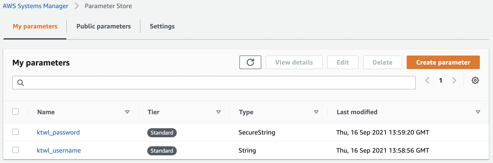

# aws-parameter-store orb example

This is a sample project to showcase how to use the [aws-parameter-store Orb]() from CircleCI.

In this example, we:

1. store my [Docker Hub]() credentials in AWS SSM Parameter Store.
2. add my AWS credentials as project environment variables.
3. fetch the Docker Hub credentials from AWS SSM Parameter Store with the Orb.
4. log in to Docker Hub (and log out).

## What did I store in AWS SSM Parameter Store?

## What to store in the project environment variables?

In this example, we store the following environment variables:

| Name | Value | Remarks |
| --- | --- | --- |
| `AWS_ACCESS_KEY_ID` | `[redacted]` | |
| `AWS_SECRET_ACCESS_KEY` | `[redacted]` | |
| `AWS_DEFAULT_REGION` | `ap-northeast-1` | My parameters were added in the `ap-northeast-1` region |

> :bulb: **Tip**: Consider granting least privilege for the IAM role (e.g., just to read Parameter Store parameters).
> https://docs.aws.amazon.com/IAM/latest/UserGuide/best-practices.html
